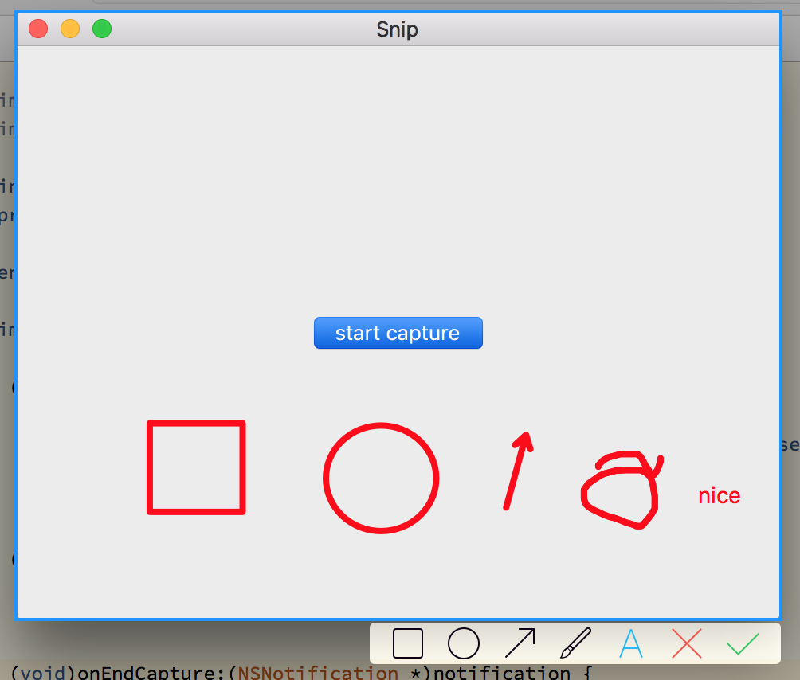

# Capture Screen For Multi Screens On Mac
There are many implementation about capture screen for mac.
 
A sample is in xcode sample code.
 
And mogutt also show code in https://github.com/mogutt/TTMacClient.
 
But on dual monitors mode, they are all not work,
 
even weixin's mac client and http://snip.qq.com/.
 
Only QQ is powerful and perfect.
 
And it's not open source.
 

#So, I try to do the capture screen sample to support dual monitors.
 
</img>
